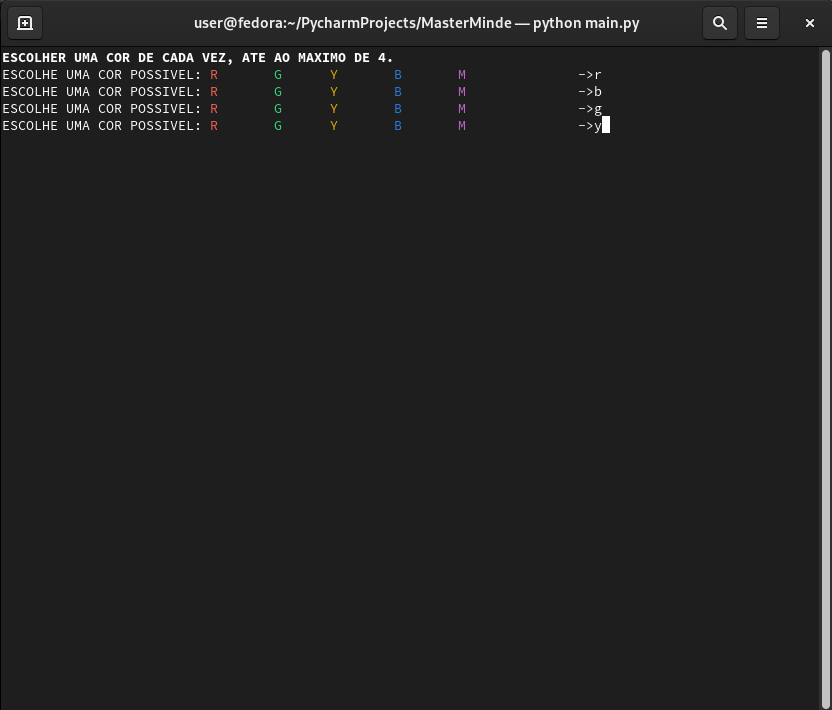
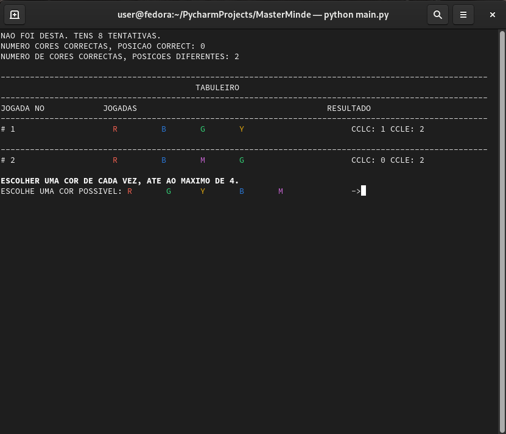
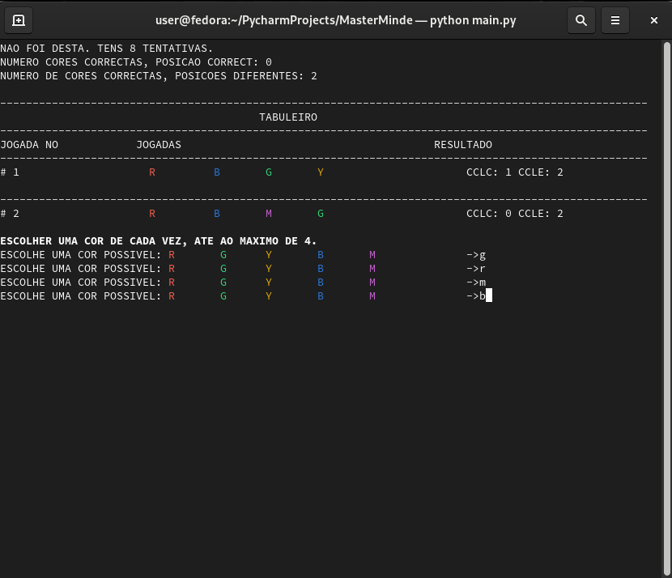
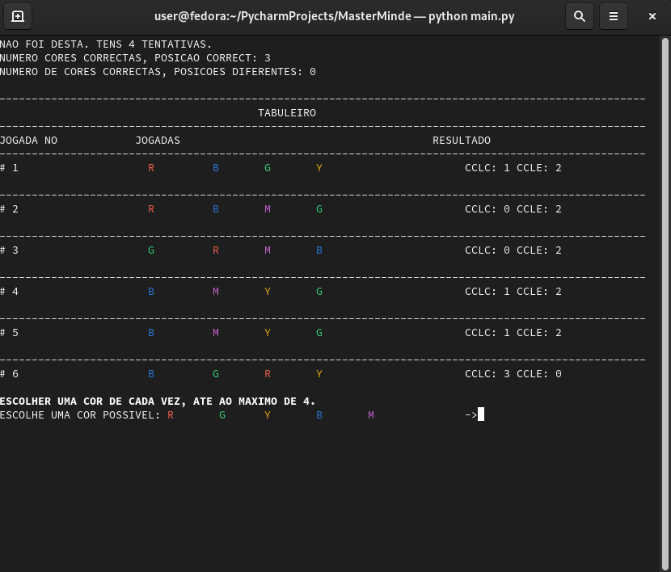
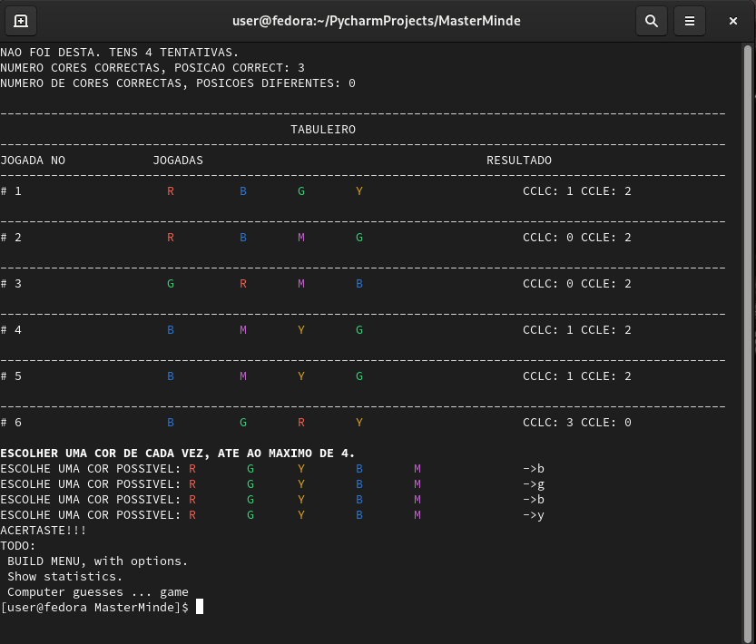

### Project name: 
  python master mind

### Description
  Play Master Mind in the command line.

### Requirements
  - Linux OS with Desktop GUI.
  - Was developed with Python 3.9.9
  
### How to play:
File __main.py__ is the entry point to the application
    
     # In the command line run: 
     python main.py
    
Escolher 4 cores, a cada vez pressionar tecla Enter.
As cores possivei são as apresentadas.

Imagem do tabuleiro, após jogada 1.
Indicadores:
 - CCLC: numero de cores correctas na posicao correcta
 - CCLE: numero de cores correctas na posicao errada

Imagem do tabuleiro, após jogada 2.

Fazer jogada 3

Imagem do tabuleiro após jogada 6.

Imagem do tabuleiro após Victória.

     